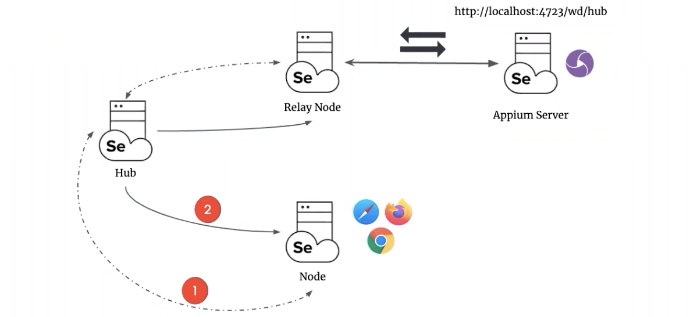

# selenium-grid-demo

## Running the tests

### Safari
Before running Safari tests, perform following commands to Allow Remote Automation:
```
defaults write com.apple.Safari AllowRemoteAutomation 1

sudo safaridriver --enable
```
### Mobile

Download applications and put them into ./src/test/resources/apps directory:
- iOS: https://github.com/saucelabs/my-demo-app-ios/releases/download/1.3.0/SauceLabs-Demo-App.Simulator.zip
- Android: https://github.com/saucelabs/my-demo-app-android/releases/download/1.0.13/mda-1.0.13-15.apk

Run the tests using `gradle test` or by running _**src/test/resources/testng.xml**_ file directly

## Registering a Webdriver service in GRID 4

In a fresh implementation of Grid, a connection of non-browser WebDrivers is implemented via **_relay_**. 
You can set up a WebDriver endpoint, and Grid Node will send commands to it. 
This service endpoint can be an Appium server or any other service (Sauce Labs, Selenium Grid 3).




### Hub & Node for Appium and browsers (locally on the same machine)

1. download Selenium Grid https://www.selenium.dev/downloads/
2. create a .toml configuration file where you set the Appium URL in the relay section and available environments in the config block;
   - ./configs/local/ios_node.toml
   - ./configs/local/android_node.toml
   - ./configs/local/browsers_node.toml
2. start Appium, which will be connected to nodes;
3. start Selenium Grid `java -jar selenium-server-4.7.0.jar hub` - connected to http://192.168.88.25:4444 by default;
4. start Selenium Grid Nodes with prepared configuration:
```
   java -jar selenium-server-4.7.0.jar node --hub http://192.168.88.25:4444 --port 5555 --config ./src/test/resources/configs/local/ios_node.toml
   java -jar selenium-server-4.7.0.jar node --hub http://192.168.88.25:4444 --port 6666 --config ./src/test/resources/configs/local/android_node.toml
   java -jar selenium-server-4.7.0.jar node --hub http://192.168.88.25:4444 --port 7777 --config ./src/test/resources/configs/local/browsers_node.toml
```
5. check connected nodes via http://localhost:4444/ui

**NOTE**: iOS/Android config files have a relay to Appium 2.x url = http://localhost:4723. Necessary to add /wd/hub to run on Appium version 1.x.

### Hub & Node for browsers (in Docker)
 
Use the appropriate docker-compose file for your architecture: amd64 (Intel) or arm64 (M1):
- to execute use: `docker-compose -f docker-compose-<architecture>.yml up`
- to stop the execution, hit Ctrl+C, and then `docker-compose -f docker-compose-<architecture>.yml down`

#### Dynamic Grid

Grid 4 has the ability to start Docker containers on demand, this means that it starts a Docker container in the background for each new session request, the test gets executed there, and when the test completes, the container gets thrown away.

To record your WebDriver session, you need to add a `se:recordVideo` field set to `true` for browser capabilities:
```
            options.setCapability("se:recordVideo", "true");
            options.setCapability("se:timeZone", "US/Pacific");
            options.setCapability("se:screenResolution", "1920x1080");
```

1. create a .toml configuration file (in my case ./configs/docker/browsers_node.toml)
2. execute using: `docker-compose -f docker-compose-dynamic-grid.yml up`
3. stop the execution: hit Ctrl+C and then `docker-compose -f docker-compose-dynamic-grid.yml down`
4. videos are saved to ./assets folder

**Known issues**: 
- `SessionNotCreatedException Could not start a new session. non-positive contentLength: 0`, introduced in 4.6, will be fixed in 4.8 (see https://github.com/SeleniumHQ/selenium/issues/11342), works for 4.5 version
- `unknown error: DevToolsActivePort file doesn't exist` for Chrome browser when running on Mac M1

### Distributed for browsers (in Docker)

`docker-compose -f docker-compose-full-grid.yml up`

## Customize a node

As an example, `com.solvd.demo.custom.CustomNode` is created that does following: 
before new session is being created on a node, it checks counter and fails (session will not be created) 
for every second request for this custom node - `CustomNodeException`.

1. Build a jar of this project by `gradle clean jar`
2. Start a hub - `java -jar selenium-server-4.7.0.jar hub`
3. Start a node using the command below where 
   --ext - path to the jar
   --node-implementation - implementation class

```
   java -jar selenium-server-4.7.0.jar \
   --ext ./build/libs/selenium-grid-demo-1.0-SNAPSHOT.jar node \
   --node-implementation com.solvd.demo.custom.CustomNode \
   --config ./src/test/resources/configs/local/browsers_node.toml \
   --hub http://192.168.88.25:4444 --port 7777
```

4. Run the tests - every second request will fail on this node
